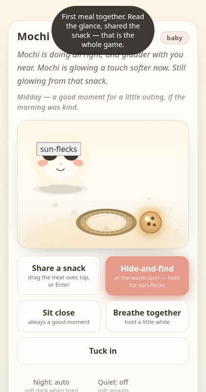
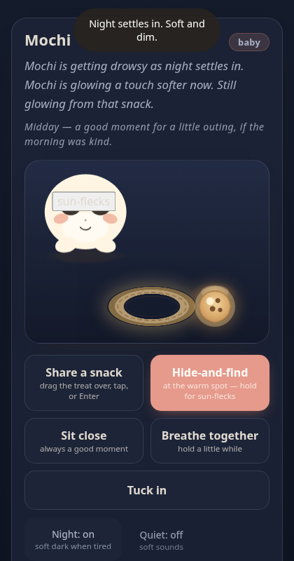

# A small friend

A standalone Tamagotchi-like virtual friend. Plain HTML, CSS, and vanilla JavaScript — zero dependencies, no build step, works offline once loaded.



## Try it

**Online:** host the `docs/` folder with any static host (e.g. GitHub Pages: Settings → Pages → Deploy from branch → `main` + `/docs`).

**Locally:**

```sh
git clone <this-repo>
cd <this-repo>
python3 -m http.server -d docs 8000
```

then open http://localhost:8000 (or `npx -y serve docs` if you prefer Node).

> Why a server? The game uses ES modules, which browsers block on `file://` for security (CORS). Double-clicking `index.html` will not work — any static server fixes it.



## How it plays

Check in a few times a day — a minute or two each. Name your friend, make one promise, and keep it:

- **Share a snack** — drag the treat over (or tap, or Enter)
- **Hide-and-find** — tap your friend when you spot them; **sun-flecks** — a midday light-chasing game, once a day
- **Sit close** — always a good moment, even with ten seconds
- **Breathe together** — press and hold a little while, for both of you
- **Tuck in** — at night it gets properly sleepy

It waits while the tab is closed (up to 12 simulated hours), greets you when you return, grows through seasons of smallness, and remembers your shared history — including, gently, an ending. There are no points, meters, or leaderboards: its condition shows in posture and words, never numbers.

## Project structure

```text
docs/
  index.html      page shell + onboarding + stage
  app.js          game loop, rituals, persistence (localStorage)
  engine.js       pure simulation: needs, growth, illness, farewell, memory
  creature.js     canvas creature renderer (baby-schema blob, gaze, moods)
  style.css       cozy day/night theme
  sound.js        tiny WebAudio chimes, mutable
  screenshots/    day.png, night.png (used above)
```

`engine.js` has no DOM in it — the rules can be tested headlessly with plain `node --check` or imports. Game state lives only in your browser's `localStorage`; nothing ever leaves your machine.

## License

MIT — see [LICENSE](LICENSE).
